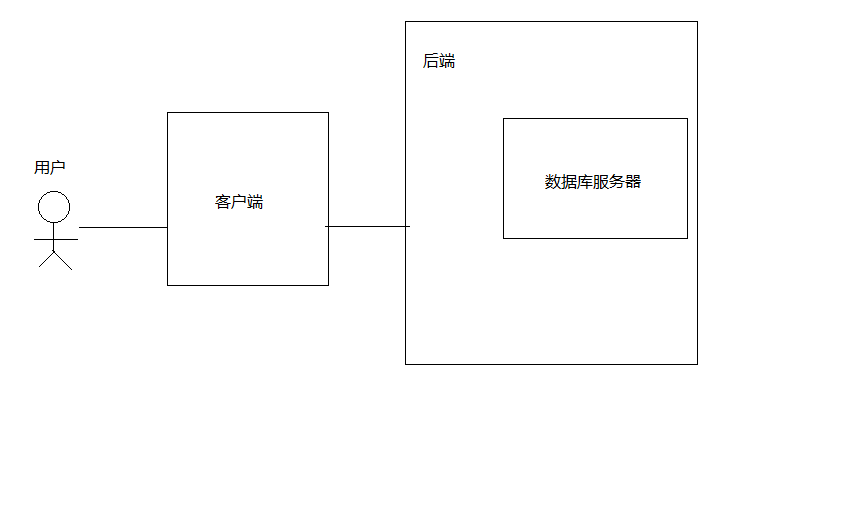
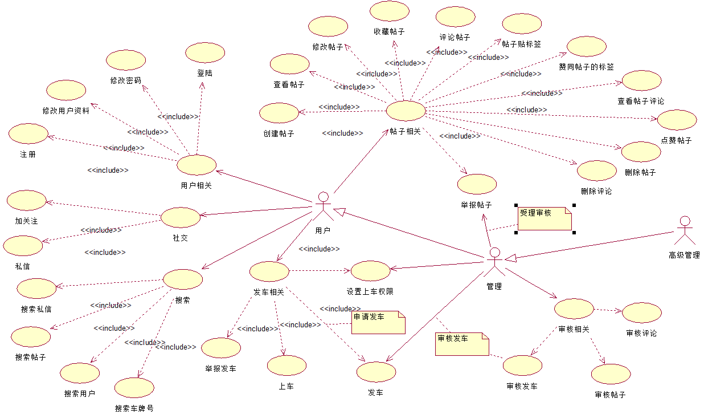
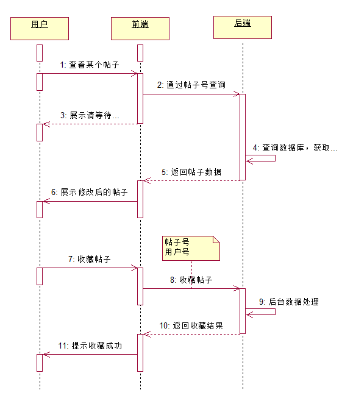

# 软件虚构规格说明文档

# 导言

## 目的

本文档是关于用户对于*秋明*的功能和性能的要求，重点描述了本系统的功能需求，是概要设计阶段的重要输入。

本文的预期预期读者：

+ 设计人员

+ 开发人员

+ 项目管理人员

+ 测试人员

+ 用户

## 背景

谈起老司机，大家可能会心一笑，心里都在打着小九九。就老司机的网络语义，其实是指在某方面领域内经验丰富，行止稳健。并无其他过多的定义和色彩，但是在网络语境下，却带上了许多色彩，大众对老司机的认知就变得有巨大误差。一些网络上的年轻人由于自制力不住，而误入歧途。

如果要成为一个为人正直，思想正确的老司机是需要千锤百炼的，涉猎要广，某个领域要深，但是网络上资源数量巨大，且良莠不齐，于是我们的项目应运而生。

秋名日报 APP 是一款集视频，音乐，图片，文章为一体的兴趣集合向 APP，主要内容抓取来源主要为 **哔哩哔哩**，**网易云**，**Pixiv**，**知乎日报**等 UGC 网站。采取日更的方式收集各个 UGC 网站的热门优质的内容，推送给用户。另一方面也会鼓励用户自行搬运亦或者发布自己的原创内容。

> 老司机，泛指某领域内经验丰富，行止稳健者。

> 老司机出自一段音乐视频《风流妹逗老司机》。歌曲基于云南山歌，其中「老司机带带我」一句反复出现。「老司机」由是渐广为人知。 「老司机带带我」也常用于见到「老司机」时表达深切的仰慕与由衷的敬意，亦可讽刺自作聪明，倚老卖老者。

## 缩写说明

UGC 用户原创内容

ACG Animation、Comic、Game的缩写，是动画、漫画、游戏的总称。

C / S

B / S

CUDA

## 术语定义

二次元：原义指二维的平面空间，也表示精密影像式测绘仪。现常用于指ACG领域所在的平面世界，包括动画（Animation）、漫画（Comic）、游戏（Game）等一系列平面的视界产物。

三次元：即现实世界，二次元世界相对应的用三次元世界来指代现实世界。

发车：指手头资源丰富的用户在网络社区发出神秘代码或网盘链接造福社会的行为。

老司机：泛指某领域内经验丰富，行止稳健者。在网络社区特指手中保有资♀源♂丰富的人。

后端：数据库的操作和管理。

前端：页面呈现界面给用户进行交流。

## 参考资料

萌娘百科

百度百科

## 版本更新信息

| 修改编号 | 修改日期 | 修改后版本 | 修改位置 | 修改内容概述 | 修改者 |
|------|------|-------|------|--------|-----|
| 001 | 2016-04-05 | 0.0.1 | 全部 | 初始化项目 | 丘映威 |

# 任务概述

## 系统定义

社群相对社区，是一个相对封闭的，规模相对小的有相互关系的人际网络，但是在 UGC 方面，社群对于社区而言有更加大的创作力和更高质量的作品出现，物以类聚，所以可以对社区的社交分为进行预设，例如 B 站的圈子，以某个确定主题进行 UGC。

本系统的专门为了热爱二次元，对新鲜事物抱有好奇之心的用户而创建的，致力于引导用户生产高质量的作品，刺激用户产生共性，增强用户粘性，增强用户归属感。

[社群与社区的区别是什么？ - 回答作者：Strayn Won](https://www.zhihu.com/question/22538129/answer/43196006?utm_campaign=webshare&utm_source=weibo&utm_medium=zhihu)

系统整体框架采取 C/S 结构，支持用户注册，登录，发帖，评论，**发车**，关注，私信等功能。偏重 UGC 部分，在社交上提供较为简单的支持。

## 应用环境

由于系统整体采取 C/S 结构，故先对后端环境进行必要描述。

下图为系统 C/S 结构与用户之前的关系。

后端，对来自前端的请求进行转化，转化为对数据库的 CUDA 操作，本系统中后端主要用以支持用户注册，登陆，用户原创行为等功能。

客户端，提供用户交互，代替用户与后端交互。

### 后端环境

完整的 Java 运行环境

mysql 数据库服务

网络带宽

### 客户端环境

安卓 2.3 以上

### 假定与约束

由于本项目经费不足，无法使用更高并发量的服务器，所以对本系统的并发访问不做过多深入探讨。其次，由于客户端是运行在安卓系统上，无法直接确定安卓系统的多数版本号，故所能提供的客户端特性以兼容为主。

对于本系统的使用用户，假定其有相关的 ACG 知识以及 MarkDown 书写经验。

# 需求规定

## 功能规格

### 用例

下图为用例图。围绕用户，展开功能，然后对功能进行划分。

### 功能类表

如下为功能列表

| 编号 | 名称 | 类别 | 子类别 | 子角色 | 角色 | 描述 |
|:--:|:--:|:--:|:---:|:---:|:--:|:--:|
| 1 | 注册 | 用户 | 用户相关 | 用户 | 用户 | 用户注册 |
| 2 | 修改用户资料 | 用户 | 用户相关 | 用户 | 用户 | 修改用户资料 |
| 3 | 修改密码 | 用户 | 用户相关 | 用户 | 用户 | 修改密码 |
| 4 | 登陆 | 用户 | 用户相关 | 用户 | 用户 | 用户登录 |
| 5 | 创建帖子 | 帖子 | 帖子相关 | 用户 | 用户 | 发帖 |
| 6 | 查看帖子 | 帖子 | 帖子相关 | 用户 | 用户 | 查看帖子 |
| 7 | 修改帖子 | 帖子 | 帖子相关 | 用户 | 用户 | 修改帖子 |
| 8 | 收藏帖子 | 帖子 | 帖子相关 | 用户 | 用户 | 收藏帖子 |
| 9 | 评论帖子 | 帖子 | 帖子相关 | 用户 | 用户 | 收藏帖子 |
| 10 | 帖子贴标签 | 帖子 | 帖子相关 | 用户 | 用户 | 帖子贴标签 |
| 11 | 赞同帖子的标签 | 帖子 | 帖子相关 | 用户 | 用户 | 赞同帖子的标签 |
| 12 | 查看帖子评论 | 帖子 | 帖子相关 | 用户 | 用户 | 查看帖子评论 |
| 13 | 点赞帖子 | 帖子 | 帖子相关 | 用户 | 用户 | 点赞帖子 |
| 14 | 删除帖子 | 帖子 | 帖子相关 | 用户/管理 | 用户 | 删除帖子 |
| 15 | 举报帖子 | 帖子 | 帖子相关 | 用户 | 用户 | 举报帖子 |
| 16 | 加关注 | 社交 | 社交相关 | 用户 | 用户 | 加关注 |
| 17 | 发送私信 | 社交 | 社交相关 | 用户 | 用户 | 发送私信 |
| 18 | 搜索私信 | 搜索 | 搜索相关 | 用户 | 用户 | 搜索私信 |
| 19 | 搜索用户 | 搜索 | 搜索相关 | 用户 | 用户 | 搜索用户 |
| 20 | 搜索车牌号 | 搜索 | 搜索相关 | 用户 | 用户 | 搜索车牌号 |
| 21 | 举报发车 | 发车 | 发车相关 | 用户 | 用户 | 举报发车 |
| 22 | 上车 | 发车 | 发车相关 | 用户 | 用户 | 上车 |
| 23 | 发车 | 发车 | 发车相关 | 用户 | 用户 | 发车 |
| 24 | 设置上车权限 | 发车 | 发车相关 | 管理/用户 | 用户 | 设置上车权限 |
| 25 | 审核发车 | 审核 | 管理相关 | 管理 | 用户 | 审核发车 |
| 26 | 审核帖子 | 审核 | 管理相关 | 管理 | 用户 | 审核帖子 |
| 27 | 审核评论 | 审核 | 管理相关 | 管理/用户 | 用户 | 审核评论 |

### 角色定义

本系统采取游客不可访问原则，注册采取邀请注册。故角色主要有**用户**、**管理员**、**高级管理员**。

社群不同于社交网络的自由化，社群需要管理者来把控入口和出口，保证社群的共性不会随着新进入者而降低。所以**管理员**以及**高级管理员**。

+ **用户**

    - 进行 UGC

+ **管理员**

    - 审核 UGC 内容

    - 引导 UGC 方向

### 客户端

如下为查看帖子流程图。

客户端作为用户和后端之间交互的界面，有着举足轻重的地位，设计好一个良好用户体验的客户端十分重要。

### 后端

参考用例图以及功能列表，后端主要负责的功能模块有用户模块，帖子模块，审核模块，评论模块，**发车模块**，社交模块，管理模块等。

 

#### 模块设计

##### 用户模块

##### 帖子模块

##### 审核模块

##### 发车模块

##### 评论模块

##### 社交模块

##### 管理模块

## 性能规定

**TODO**

## 输入输出的要求

由于系统采取 C / S 结构，在数据传输上，决定采用 json 格式进行数据的封装。

用户上传的图片，视频等需要作出裁剪或者转码处理，用户发帖采取的文本格式为 markdown，而不是用富文本。

# 发布

## 发布的产品

## 发布环境

